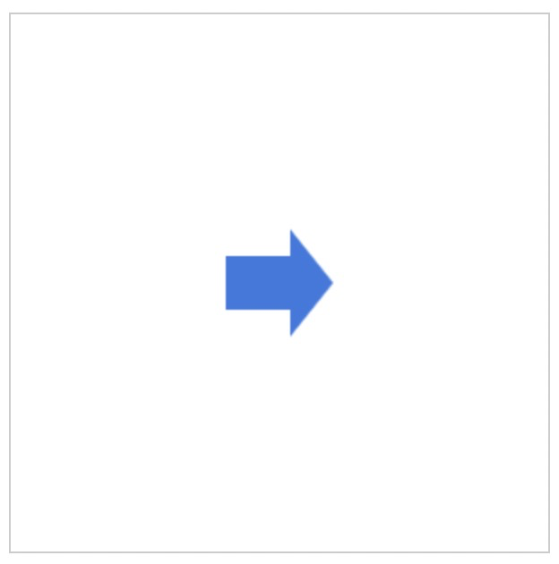
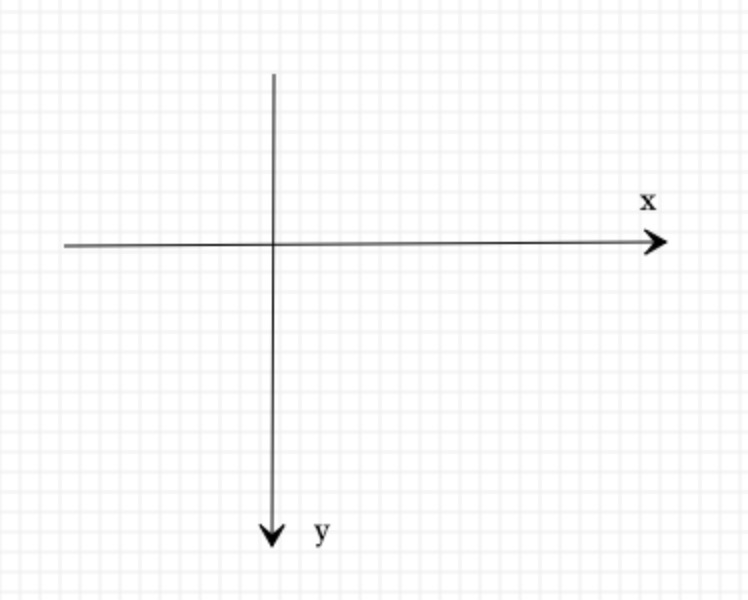
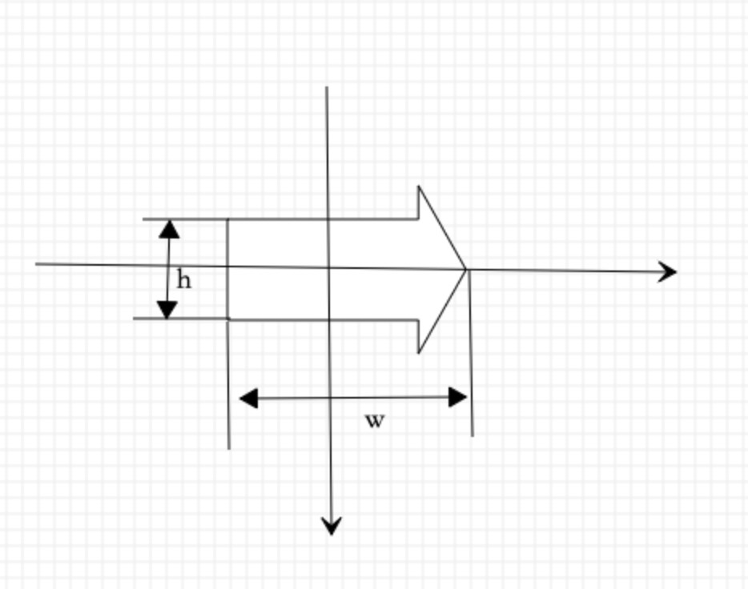

# canvas基础之绘制箭头

先看下效果图 





### canvas坐标系
canvas坐标系和我们在数学中学到的坐标系不同，y轴向下为正方向
  

### 绘制


1. 假设箭头的宽高为w, h。
2. translate() 方法重新映射画布上的 (0,0) 位置。利用此方法改变画布原点为箭头中心点坐标。
3. rotate(angle) 方法旋转当前的绘图,angle以弧度计。如需将角度转换为弧度，请使用 degrees*Math.PI/180 公式进行计算。


#### 开始绘制
```
var ocanvas=document.getElementById('mycanvas'),
    ctx=ocanvas.getContext('2d'),
    W=ocanvas.width,
    H=ocanvas.height;
    // 设置画布的中点为原点
    ctx.translate(W/2, H/2);
    ctx.beginPath();
    // 移动画笔到指定点 
    ctx.moveTo(-w/2, -h/2);
    // 绘制直线 
    ctx.lineTo(w/10, -h/2);
    ctx.lineTo(w/10, -h);
    ctx.lineTo(w/2, 0);
    ctx.lineTo(w/10, h);
    ctx.lineTo(w/10, h/2);
    ctx.lineTo(-w/2, h/2);
    ctx.closePath();
    // 设置填充颜色 
    ctx.fillStyle = 'rgb(57, 119, 224)';
    // 设置绘制颜色 
    ctx.strokeStyle = 'rgba(0, 0, 0, 0)';
    // 填充动作
    ctx.fill();
    // 描边动作
    ctx.stroke();
```

### 实现一个箭头类
```
/**
 * 绘制箭头类
 */

class Arrow {
  constructor(props){
    this.x = 0;
    this.y = 0;
    this.w = 60;
    this.h = 30;
    // 箭头旋转角度
    this.rotation = 0;
    this.fillStyle = 'rgb(57, 119, 224)';
    this.strokeStyle = 'rgba(0, 0, 0, 0)';
    Object.assign(this, props);
    return this;
  }
  createPath(ctx){
    let {w, h} = this;
    ctx.beginPath();
    ctx.moveTo(-w/2, -h/2);
    ctx.lineTo(w/10, -h/2);
    ctx.lineTo(w/10, -h);
    ctx.lineTo(w/2, 0);
    ctx.lineTo(w/10, h);
    ctx.lineTo(w/10, h/2);
    ctx.lineTo(-w/2, h/2);
    ctx.closePath();
    return this;
  }
  render(ctx){
    let {fillStyle, strokeStyle, rotation, x, y} = this;
    ctx.save();
    ctx.fillStyle = fillStyle;
    ctx.strokeStyle = strokeStyle;
    ctx.translate(x, y);
    ctx.rotate(rotation);
    this.createPath(ctx);
    ctx.fill();
    ctx.stroke();
    ctx.restore();
    return this;
  }
}

```
### 使用
```
var ocanvas=document.getElementById('mycanvas'),
	ctx=ocanvas.getContext('2d'),
    W=ocanvas.width,
    H=ocanvas.height;

let arrow=new Arrow({
    x:W/2,
    y:H/2,
    rotation:Math.PI/180*30
}).render(ctx)
```

源码地址：[https://github.com/tomatoKnightJ/Blog/blob/main/src/arrow.js](https://github.com/tomatoKnightJ/Blog/blob/main/src/arrow.js)
