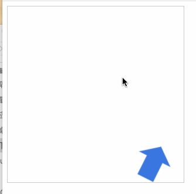
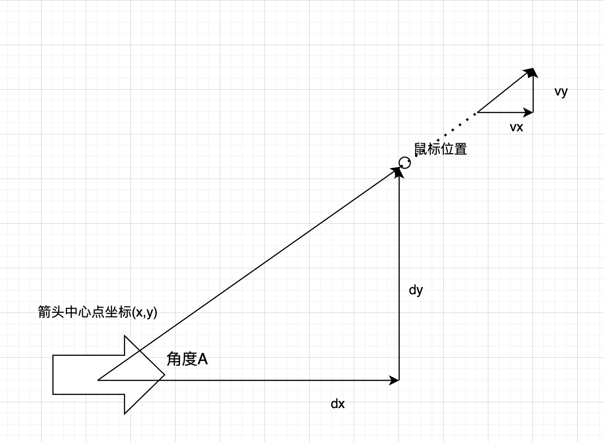

# 箭头跟随鼠标移动效果


### canvas动画原理
1. canvas 绘制的是一张静态图片，可通过每隔一定时间清除之前图形然后重新绘制下一帧图形，用来模拟出一个动画过程，可以使用context.clearRect(0, 0, width, height)方法来刷新需要绘制的图形。
2. 通过window.requestAnimationFrame方法定时执行。
3. 基于上一章的[箭头类](https://github.com/tomatoKnightJ/Blog/issues/6)实现。


### 动画分析

  


- 通过观察发现鼠标的位置距离箭头越远，箭头的速度则越快，反之则越慢
- 速度向量与距离向量成相似三角形

获取鼠标当前在画布上的位置信息
```
function getxy(ele){
	let mouse={x:0,y:0};
	ele.addEventListener('mousemove',function(e){
		let ev=e || window.event;
        let {pageX, pageY, target} = ev;
  	    let {left, top} = target.getBoundingClientRect();
		let {x,y} = {x: pageX - left, y: pageY - top}
		mouse.x=x;
		mouse.y=y;
	});
	return mouse;
}
```
通过获取鼠标的位置信息得到箭头到鼠标的xy坐标距离为dx, dy,通过勾股定理可以获取斜边长度为 `d = (Math.sqrt(dx*dx+dy*dy))`，由d乘以速度系数0.1（系数0到1之间的小数，值越大速度越快）

```
(function move(){
    window.requestAnimationFrame(move);
    ctx.clearRect(0,0,W,H);
    let dx = mouse.x-arrow.x,
        dy = mouse.y-arrow.y,
        speed = (Math.sqrt(dx*dx+dy*dy))*0.9,
        angle = Math.atan2(dy,dx),
        vx = speed*Math.cos(angle),
        vy = speed*Math.sin(angle);	
        // 防止箭头方向出错，当箭头到达鼠标位置时dx=dy=0,导致angle等于0
    if(Math.abs(dx) > 0.1 || Math.abs(dy) > 0.1) {
        arrow.rotation = angle;
        arrow.x += vx;
        arrow.y += vy;
    }
    arrow.render(ctx);	
})()
```
源码地址：[https://github.com/tomatoKnightJ/Blog/blob/main/src/canvas/canvas%E7%AE%AD%E5%A4%B4%E8%B7%9F%E9%9A%8F%E9%BC%A0%E6%A0%87.html](https://github.com/tomatoKnightJ/Blog/blob/main/src/canvas/canvas%E7%AE%AD%E5%A4%B4%E8%B7%9F%E9%9A%8F%E9%BC%A0%E6%A0%87.html)